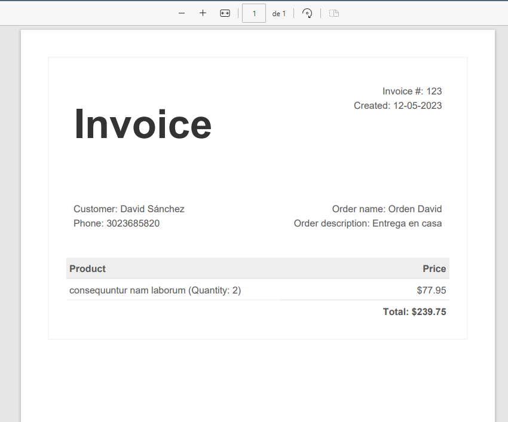

# Lite Thinking backend

## Requirements

Before starting, make sure that you have the following requirements:

-   PHP 8.1
-   Composer
-   Node.js and npm
-   MySQL

## Database Configuration

Before running the Laravel application, you need to update the database configuration in the `.env` file. The `.env` file is located in the root directory of your project.

1. Rename the `.env.example` file to `.env`.

2. Open the `.env` file in a text editor and update the following lines with your database details:

```
DB_CONNECTION=mysql
DB_HOST=127.0.0.1
DB_PORT=3306
DB_DATABASE=your_database_name
DB_USERNAME=your_database_username
DB_PASSWORD=your_database_password
```

3. Save the changes to the `.env` file

## Compiling Assets

Since we're using Inertia and React.js, we need to compile the assets using the following commands:

1. Run the following command to install the required npm packages:

```
npm install
```

2. Run the following command to compile the assets:

```
npm run dev
```

## Running the Application

To start the Laravel application, navigate to the root directory of your project in the terminal and run the following command:

```
composer install
```

```
php artisan serve
```

This will start a development server at `http://localhost:8000`.

You can now visit the application in your web browser by navigating to `http://localhost:8000`.

# Admin Dashboard

Go to http://localhost:8000/login

## Screenshots





